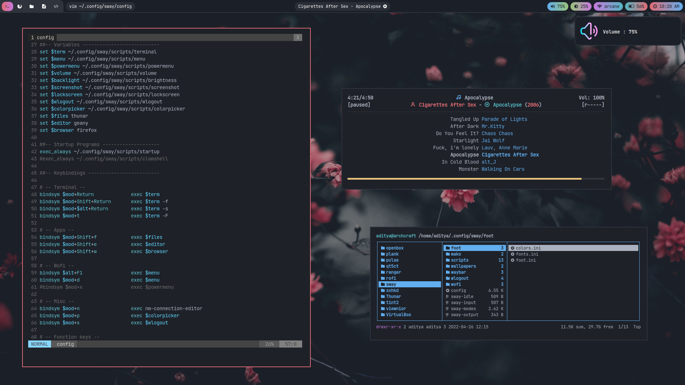
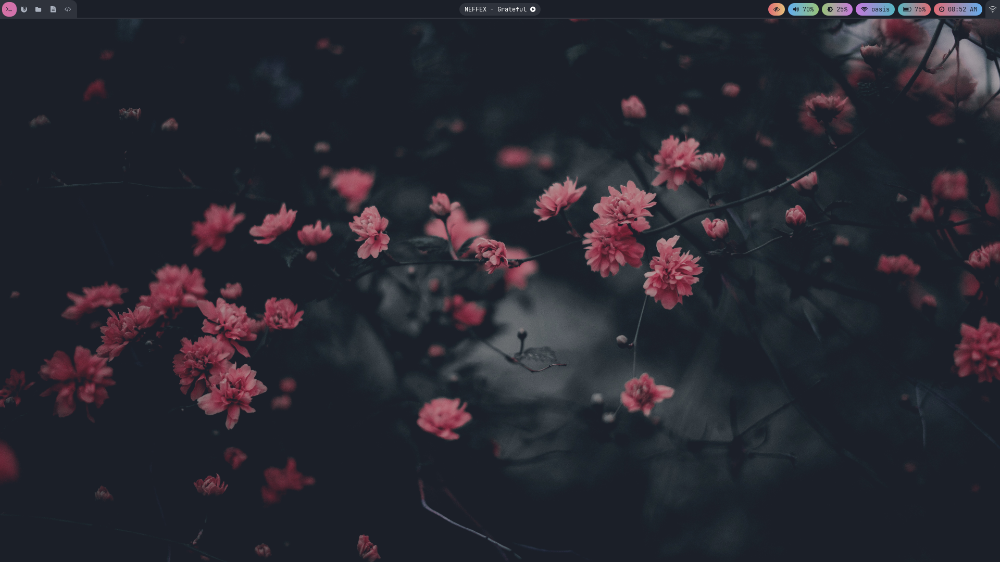
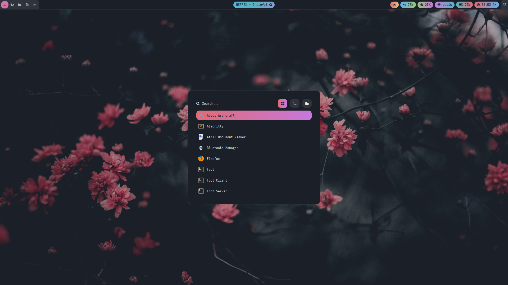
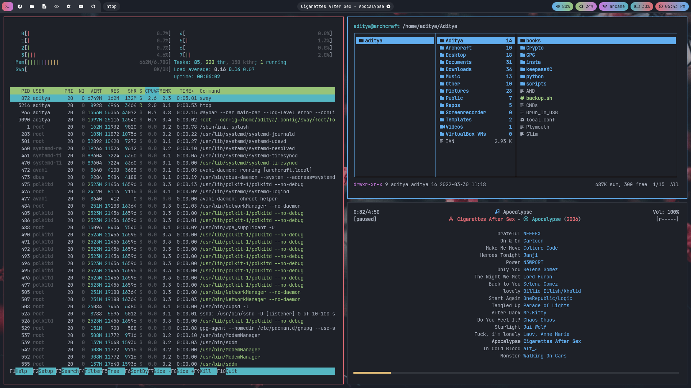
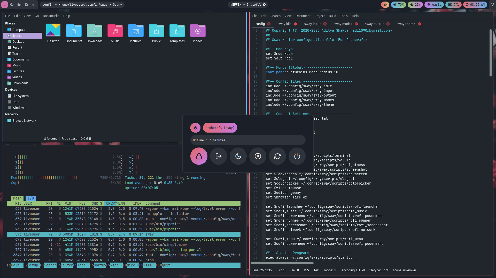
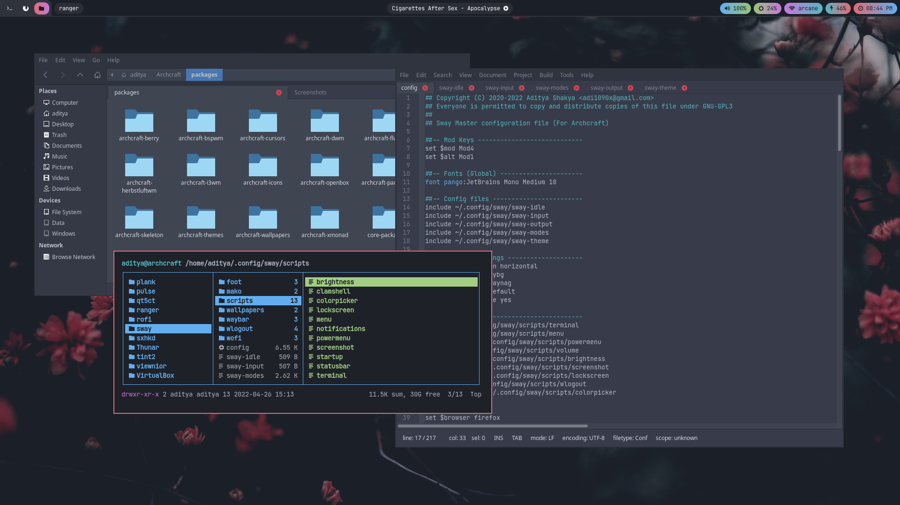
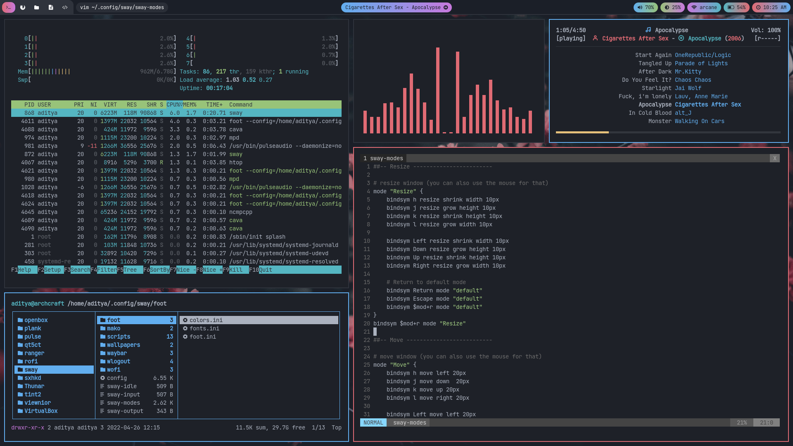
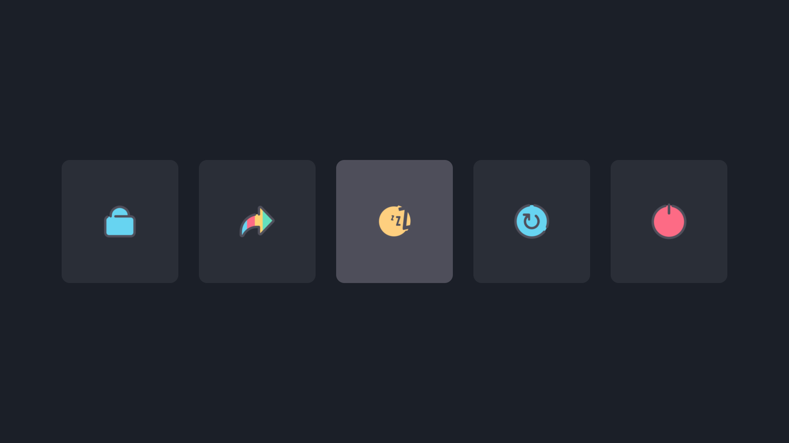

<h1 align="center">SWAY</h1>

[](https://youtu.be/ASlQcf8Jc0I)

<p align="center">The ultimate Sway configuration (A Desktop Environment Like Experience)</p>

---

## Overview

Sway is a tiling Wayland compositor and a drop-in replacement for the i3 window manager for X11. It works with your existing i3 configuration and supports most of i3's features, plus a few extras. 

- **Operating System** : `Archcraft`
- **Window Manager** : `Sway`
- **Status Bar** : `Waybar`
- **Launcher** : `Wofi`
- **Session Manager** : `Wlogout`
- **Notifications** : `Mako`
- **Terminal** : `Foot`
- **File Manager** : `Thunar`
- **Text Editor** : `Geany`
- **Web Browser** : `Firefox`

## Installation
- Get the files from : [Ko-fi :coffee:](https://ko-fi.com/s/10f2e87af3)
- Extract The file **sway.tar.gz** with : `tar -xzvf sway.tar.gz`
- If you are using **`Archcraft`** as your OS, You can just install the provided package with : `sudo pacman -U archcraft-sway-1.0-3-any.pkg.tar.zst`
- If you want to install this setup on _Arch Linux_ or on any _other distro_, follow the points below :
  - Install the following programs on your computer: `sway` `swaybg` `swayidle` `swaylock` `wlroots` `wl-clipboard` `waybar` `wofi`  `kanshi` `foot` `mako` `grim` `slurp` `wf-recorder` `light` `yad` `wlogout` `thunar` `geany` `mpv` `mpd` `mpc` `viewnior` `imagemagick` `xfce-polkit` `xorg-xwayland`
  - After installing programs above, Create sway directory in **`~/.config`** : `mkdir -p ~/.config/sway`
  - Copy Everything from _dotfiles_ to **`~/.config/sway`** : `cp -r ./dotfiles/* ~/.config/sway/` 
  - Logout and login to your amazingly configured Sway WM.

### Appearance

Install the following `theme`, `icon pack`, `cursors` and `fonts` for overall appearance.

- GTK Theme : [Arc-Dark gtk theme](https://github.com/horst3180/arc-theme)
- Icon Theme : [Zafiro Blue icon theme](https://github.com/zayronxio/Zafiro-icons)
- Cursor Theme : [Qogir cursor theme](https://www.gnome-look.org/p/1366182/)
- Fonts : [JetBrainsMono Nerd Font](https://github.com/ryanoasis/nerd-fonts/releases/download/v2.1.0/JetBrainsMono.zip), [Iosevka Nerd Font](https://github.com/ryanoasis/nerd-fonts/releases/download/v2.1.0/Iosevka.zip), [Icomoon Feather](https://github.com/archcraft-os/archcraft-packages/blob/main/archcraft-fonts/files/icon-fonts/Icomoon-Feather.ttf), [Archcraft](https://github.com/archcraft-os/archcraft-packages/blob/main/archcraft-fonts/files/icon-fonts/archcraft.ttf)

## Config Structure
```
~/.config
└── sway              : Sway config directory
    ├── foot          : Terminal config
    ├── mako          : Notification daemon config
    │   └── icons     : Notification icons
    ├── scripts       : Various scripts for functionality
    ├── wallpapers    : Wallpapers
    ├── waybar        : Statusbar config
    ├── wlogout       : Wlogout config
    │   └── icons     : Session icons
    ├── wofi          : Launcher config
    ├── config        : Main sway config
    ├── sway-idle     : Sway idle config
    ├── sway-input    : Sway input config
    ├── sway-modes    : Sway mode config
    ├── sway-output   : Sway output config
    └── sway-theme    : Sway theme config
```

## Keybindings

| Keys | Action |
| --- | --- |
| <kbd>super + Return</kbd> | Open terminal |
| <kbd>super + shift + Return</kbd> | Open floating terminal |
| <kbd>super + alt + Return</kbd> | Open terminal with custom geometry |
| <kbd>super + T</kbd> | Open fullscreen terminal |
| <kbd>super + shift + F</kbd> | Open file manager |
| <kbd>super + shift + E</kbd> | Open text editor |
| <kbd>super + shift + W</kbd> | Open web browser|
| <kbd>super + D</kbd> | Run app launcher |
| <kbd>super + N</kbd> | Open network manager |
| <kbd>super + X</kbd> | Run session manager |
| <kbd>super + P</kbd> | Run colorpicker |
| <kbd>super + C/Q</kbd> | Kill active window |
| <kbd>ctrl + alt + L</kbd> | Run lockscreen |
| <kbd>super + shift + C</kbd> | Reload sway config |
| <kbd>super + shift + Q</kbd> | Quit sway session |
| <kbd>super + 1,2..9,0</kbd> | Change workspace from 1 to 10 |
| <kbd>super + shift + 1,2..9,0</kbd> | Move active window to repective workspace |
| <kbd>super + Left</kbd> | Change focus to the left container |
| <kbd>super + Right</kbd> | Change focus to the right container |
| <kbd>super + Up</kbd> | Change focus to the upper container |
| <kbd>super + Down</kbd> | Change focus to the lower container |
| <kbd>super + shift + Left</kbd> | Move focused container to the left |
| <kbd>super + shift + Right</kbd> | Move focused container to the right |
| <kbd>super + shift + Up</kbd> | Move focused container to the upper |
| <kbd>super + shift + Down</kbd> | Move focused container to the lower |
| <kbd>super + B</kbd> | Split container horizontally |
| <kbd>super + V</kbd> | Split container vertically |
| <kbd>super + S</kbd> | Change container layout to stacked |
| <kbd>super + W</kbd> | Change container layout to tabbed |
| <kbd>super + E</kbd> | Change container layout to toggle split |
| <kbd>super + F</kbd> | Toggle fullscreen mode |
| <kbd>super + Space</kbd> | Toggle floating mode |
| <kbd>super + shift + Space</kbd> | Toggle focus b/w tile and floating mode |
| <kbd>super + R</kbd> | Start resizing mode |
| <kbd>super + M</kbd> | Start moving mode |
| <kbd>super + G</kbd> | Start gaps mode |
| <kbd>super + O</kbd> | Start opacity mode |
| <kbd>super + A</kbd> | Focus parent container |
| <kbd>super + Z</kbd> | Focus child container |
| <kbd>super + Minus</kbd> | Toggle scratchpad window |
| <kbd>super + shift + Minus</kbd> | Move the currently focused window to the scratchpad |

## Screenshots

| App Launcher (wofi) | Terminal (foot) |
| --- | --- |
|||

| Tile Mode | Floating Mode |
| --- | --- |
|||

| Runnig thunar, geany and ranger | Running vim, ncmpcpp and ranger |
| --- | --- |
|||

| Another tile mode | Wlogout |
| --- | --- |
|||


## FYI
- May or may not work on [**`Nvidia`**](https://wiki.archlinux.org/title/Sway#Installation), See [wayland requirements](https://wiki.archlinux.org/title/wayland#Requirements).
- Thank you for your support.

---

### See Also

| [**`archcraft-river`**](https://github.com/archcraft-os/archcraft-river) | [**`archcraft-wayfire`**](https://github.com/archcraft-os/archcraft-wayfire) | [**`archcraft-hyprland`**](https://github.com/archcraft-os/archcraft-hyprland) | [**`archcraft-newm`**](https://github.com/archcraft-os/archcraft-newm) |
| --- | --- | --- | --- |
|[](https://github.com/archcraft-os/archcraft-river)|[](https://github.com/archcraft-os/archcraft-wayfire)|[](https://github.com/archcraft-os/archcraft-hyprland)|[](https://github.com/archcraft-os/archcraft-newm)|
